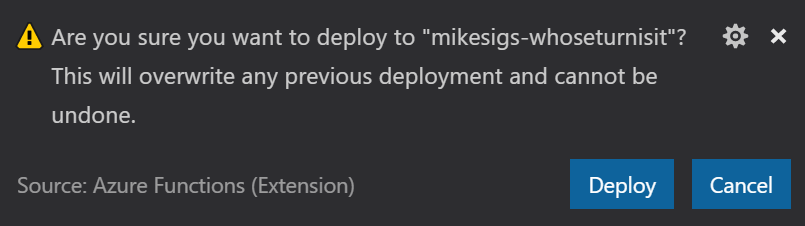

+++
title = "Building Azure Functions With F# and VS Code - Deploy the Function App to Azure"
date = 2018-03-08T22:32:30-07:00
tags = ['Azure', 'F#', 'Azure Functions', 'Visual Studio Code']
draft = true
+++

This is Step 4 in a [series of posts](../toc) where I walk you through the steps required to create a simple Azure Function using F# Script, VS Code, and v1 of the Azure Functions Core Tools.
I'll cover everything from what you need to install, all the way through creating the function, and deploying it to your Azure account.

1. [Setup](../1-setup)
2. [Create the Function App](../2-create-function-app)
3. [Run the Function Locally](../3-running-locally)
4. **[Deploy the Function App to Azure](../4-deploy-to-azure)** :arrow_backward:

## Deploy the Function App to Azure

Now that we have the function working locally, let's publish it to Azure.

### Create Azure Resource Group

```shell
az group create --name mikesigs-whoseturnisit --location canadacentral
```

### Create Azure Storage Account

```shell
az storage account create --name mikesigsfunctionsstorage --location canadacentral --resource-group mikesigs-whoseturnisit --sku Standard_LRS
```

### Create Function App

```shell
az storage account create --name mikesigsfunctionsstorage --location canadacentral --resource-group mikesigs-whoseturnisit --sku Standard_LRS
```

---

Again, we could do this from the CLI with `func azure functionapp publish <FunctionAppName>`, but we're gonna stick to using the VS Code Azure Functions extension for this too.

In the VS Code sidebar, find the Azure Functions panel again. Hover your mouse over it and this time click the `Deploy to Function App` button.


The VS Code command palette will now prompt you for a few bits of info before deploying your function.

1. **Select the folder to zip and deploy:** Hit [Enter] to select the current folder.
2. **Select a Subscription:** Hit [Enter] to select the current subscription. //TODO - Did we login already?
3. **Select a Function App:** mikesigs-whoseturnisit

Next you should see a prompt in the bottom corner confirming that you actually do what to overwrite your existing function. Click "Deploy".



If all goes well you should see a bunch of white text in the VS Code Output window with no errors whatsoever. Although, it will tell you that:

> WARNING: Some http trigger urls cannot be displayed in the output window because they require an authentication token. Instead, you may copy them from the Azure Functions explorer.

So we need to get a URL to our deployed function. And we need a token to call it. Let's get to that in the next section.

{}

In the real world, you wouldn't deploy to Azure like this. You would have a proper CI/CD pipeline to build, test, and _then_ deploy the function!

{}

### Test your deployed function

To test our deployed function we'll need to figure out what the URL is. Additionally, we'll need a token to authenticate the request. Now you could login to the [Azure Portal](https://portal.azure.com) and dig through a bunch of screens to find that. I'm sure there's probably some fancy way to do it from the CLI even. But fortunately we needn't look any further than the VS Code Azure Functions extension, once again. 

Expand the Azure Functions panel and drill down into your function app. Expand the Functions section and right-click on your new function, and select "Copy Function Url". This will put the URL and the token you need on to the clipboard.

Now head on over to Postman again, and let's fire a request at this bad boy.

Simply replace the localhost URL with the one on your clipboard and click Send. It might take a second or two, but you should soon get the same response that you received locally.

## What's next?

So now you have a function that can say "Hi". That's great. But you can do so much more! You can create new functions, with all sorts of triggers. You can store data in Cosmos! There's plenty of options for Azure Functions. And we're just scratching the surface. 