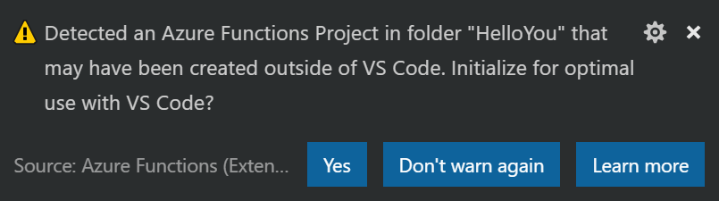

## Setup your environment

There are several IDEs that you can use to develop F# applications. Visual Studio 2015, 2017, and Visual Studio Code. Each has it's own list of pros and cons.
For this post we'll be using Visual Studio Code.

### 1) Install Visual Studio Code

Say nice things about [Visual Studio Code](https://code.visualstudio.com/). Install it. Now. Or else.

### 2) Install F\#

You might not need to do this if you have Visual Studio installed and included support for F#. But perhaps, just to be on the safe side, install the latest version based on your system from here: [F#](http://fsharp.org/)

### 3) Install the Ionide plugins

Ionide is awesome. It does cool stuff like:

- A
- B
- C

It uses another project called FORGE to do a lot of this awesome stuff. Install it using the Visual Studio Code Extensions Marketplace.

More info: [Ionide](http://ionide.io/) plugin

These are the plugins you are looking for:

- Ionide-fsharp
- Ionide-Paket (optional)
- Ionide-FAKE (optional)

### 4) Install the Azure Functions Core Tools

This awesome command line tool let's you run your functions locally. It's not a simulation of the runtime. It **is** the runtime.
[Azure Functions Core Tools](https://www.npmjs.com/package/azure-functions-core-tools/)
We're gonna use v1.0. I tried v2.0 and didn't feel like it was ready yet. Let's blog more about that later.

```shell
npm i -g azure-functions-core-tools
```

## Create your first project

### Create Azure Resource Group

```shell
az group create --name mikesigs-whoseturnisit --location canadacentral
```

### Create Azure Storage Account

```shell
az storage account create --name mikesigsfunctionsstorage --location canadacentral --resource-group mikesigs-whoseturnisit --sku Standard_LRS
```

### Create Function App

```shell
az storage account create --name mikesigsfunctionsstorage --location canadacentral --resource-group mikesigs-whoseturnisit --sku Standard_LRS
```

---

## Create Your Function App

Run the `func init` command to create a directory for your project. This will create a directory
with the supplied name, and populate it with `host.json` and `local.settings.json`. It will also initialize the directory as a git repository with a `.gitignore` file.

```shell
func init WhoseTurnIsIt
```

Now open the project up in VS Code! (Do this from the CLI in two lines:

```shell
cd WhoseTurnIsIt
code .
```

### Install the Azure Functions extension

Search the Marketplace in VS Code for the Azure Functions extension. We'll be using this extension uh... extensively throughout this tutorial.

It will let us do all sorts of things. But you will immediately see the value it brings right after you install it and reload VS Code.

When you switch to the File Explorer you will see the following prompt:



Of course you should click Yes for [a long list of reasons](https://github.com/Microsoft/vscode-azurefunctions/blob/master/docs/project.md).

Granted, it's not _as_ benefitical for an F# project, but still worth it for the `Tasks.json` alone.

### Use the Azure Storage Emulator

**DO I REALLY WANT OR NEED THIS???**

In the `local.settings.json` file, tell the Azure Web Jobs Storage and Dashboard to use the local emulator.

```json
{
  "IsEncrypted": false,
  "Values": {
    "AzureWebJobsStorage": "UseDevelopmentStorage=true",
    "AzureWebJobsDashboard": "UseDevelopmentStorage=true"
  }
}
```

### Grab the settings from Azure

Pull down the Application Settings from Azure for your function. Why? I don't know. Just do it okay...

```shell
func azure functionapp fetch-app-settings mikesigs-whoseturnisit
```

This will update your `local.settings.json` file to match the settings in Azure.

### Create a Function

There's a few ways you can create a new function. You could use the `func new` command on the CLI, or you could use the Azure Functions extension in VS Code. They both run through similar steps, prompting you for the details of your function. So take your pick, but for the purposes of this post we're going to use the VS Code extension.

In VS Code, in the sidebar, look for the Azure Functions panel. Hover your mouse over it and you'll see a few buttons. Click on the `Create Function` button.


The VS Code command palette will now prompt you for a few bits of info before creating your function. 

1. **The folder containing your function app:** Hit [Enter] to select the current folder.
2. **Select a function template:** Generic webhook
3. **Provide a function name:** WhoPickedWhat

This creates the folder `WhoPickedWhat` with the following files:

- **function.json:** Binding information about the function
- **run.fsx:** The function code itself
- **sample.dat:** A sample data file

#### Editor Prelude

If you open up `run.fsx` you'll notice VS Code giving you a lot of squigglies. So many undefined types! Well, not actually. At runtime, the Azure Functions hosting environment automatically loads [a bunch of namespaces and assemblies](https://docs.microsoft.com/en-us/azure/azure-functions/functions-reference-fsharp#referencing-external-assemblies) for you. Unfortunately, VS Code knows nothing about them. So to make VS Code happy you can add the following code to the beginning of `run.fsx`

```fsharp
#if !COMPILED

#I @"C:/Program Files/nodejs/node_modules/azure-functions-core-tools/bin/"

#r "Microsoft.Azure.Webjobs.Host.dll"
open Microsoft.Azure.WebJobs.Host

#r "System.Net.Http.Formatting.dll"
#r "System.Web.Http.dll"
#r "System.Net.Http.dll"
#r "Newtonsoft.Json.dll"

#else

#r "System.Net.Http"
#r "Newtonsoft.Json"

#endif
```

All credit goes to Mikhail Shilkov for this snippet of code. While Microsoft aludes to this [editor prelude](https://docs.microsoft.com/en-us/azure/azure-functions/functions-reference-fsharp#editor-prelude),  their suggested fix doesn't actually seem to resolve the squigglies. [Mikhail's](https://github.com/mikhailshilkov/azure-functions-fsharp-examples#4-function-created-with-cli), on the other hand, does!

It is actually because of the need for this messy prelude that I prefer to avoid F# Script altogether, and instead work with precompiled F# instead. But, more on that later...

#### What the Function?!

Sorry. I could resist that stupid heading. I'll regret it later.

So what does all this sample code do? What else? It's Hello World.

First we open up the namespaces we'll be needing:

```fsharp
open System.Net
open System.Net.Http
open Newtonsoft.Json
```

Then we create a couple record types to use in the function:

```fsharp
type Name = {
    First: string
    Last: string
}

type Greeting = {
    Greeting: string
}
```

Then there's the actual `Run` function taking two parameters:

1) The incoming `HttpRequestMessage`. This is what's known as a binding, and it is configured in the `function.json` file. We'll look at that in the next section.

2) A logger that we can use to uh... log stuff. This is automatically injected for us by the runtime.

The function body itself is wrapped in an [asynchronous workflow](https://docs.microsoft.com/en-us/dotnet/fsharp/language-reference/asynchronous-workflows). This is similar to a C# `async Task Method()`, but it's using an F# feature called a [computation expression](https://docs.microsoft.com/en-us/dotnet/fsharp/language-reference/computation-expressions) which is essentiall a monad. But let's not even go there. Let's just leave it at: we can make async calls inside this thing.

Next we:

- Use our injected logger to write some super helpful information to the console
- Asynchronously read the body of our http request and bind that value to `jsonContent`
- Use Json.Net to deserialize the string into the `name` binding; which happens to now be of the type `Name`, from the above `Name` record type
- If all goes well we return a `Task<HttpResponseMessage>` with status 200, and some JSON expressing a sincere hello to the calling client
- If the JSON deserialization goes horrible awry, then we return a 400 BadRequest with absolutely no detail whatsover. Because hackers.
- Finally, at the very end it's all piped into the `Async.StartAsTask` function to begin the async workflow

```fsharp
let Run(req: HttpRequestMessage, log: TraceWriter) =
    async {
        log.Info("Webhook was triggered!")
        let! jsonContent = req.Content.ReadAsStringAsync() |> Async.AwaitTask

        try
            let name = JsonConvert.DeserializeObject<Name>(jsonContent)
            return req.CreateResponse(HttpStatusCode.OK,
                { Greeting = sprintf "Hello %s %s!" name.First name.Last })
        with _ ->
            return req.CreateResponse(HttpStatusCode.BadRequest)
    } |> Async.StartAsTask
```

### Function Bindings

Every function can include input and output bindings. There isn't much point in my explaining this, when there is perfectly good and thorough documentation [here](https://docs.microsoft.com/en-us/azure/azure-functions/functions-triggers-bindings).

In our case, we are using v1.0 of the runtime, so we don't have to bother registering our binding extensions. We can just use the ones we want because they're already made available to us by the runtime.

Bindings are defined in teh `functions.json` file, which in our case looks like this:

```json
{
  "disabled": false,
  "bindings": [
    {
      "type": "httpTrigger",
      "direction": "in",
      "webHookType": "genericJson",
      "name": "req"
    },
    {
      "type": "http",
      "direction": "out",
      "name": "res"
    }
  ]
}
```

Here we can see we have two bindings. Our input binding of type `httpTrigger` named `req`, and the out binding, which is simply our returned HttpResponseMessage type.

You will notice that the logger isn't mentioned here. And it doesn't need to be. It is automatically made available to us, and entirely optional to use. Thought it is extremely helpful for logging, so why not use it!

### Sample Data

I don't know why the template creates a `sample.dat` file. It's not used anywhere. Feel free to delete it.

---

## Running the Function

So you've got your function created, and you want to test it out! First thing you gotta do is get it running. Once again, you can do this on the CLI with the `func host start` command, or you can leverage the VS Code Azure Functions extension. Remember when you first installed the extension and it asked to "Initialize for optimate use with VS Code"? Part of that was the `Tasks.json` file it created in the `.vscode` folder in your workspace. Let's look at that now.

```json
{
  "version": "2.0.0",
  "tasks": [
    {
      "label": "Run Functions Host",
      "identifier": "runFunctionsHost",
      "type": "shell",
      "command": "func host start",
      "isBackground": true,
      "presentation": {
        "reveal": "always"
      },
      "problemMatcher": [
        {
          "owner": "azureFunctions",
          "pattern": [
            {
              "regexp": "\\b\\B",
              "file": 1,
              "location": 2,
              "message": 3
            }
          ],
          "background": {
            "activeOnStart": true,
            "beginsPattern": "^.*Stopping host.*",
            "endsPattern": "^.*Job host started.*"
          }
        }
      ]
    }
  ]
}
```

This task, as the label suggests, will let you run your function in the Azure Functions host. To invoke this task, open the Command Pallette with `Ctrl+Shift+P` and type "task" then select "Tasks: Run Task". You should see the integrated terminal open in VS Code, displaying a sweet ASCII lightning bolt. Voila! Your function is running. To stop the host just press `Ctrl+C` while in the Terminal.

### Pro-Tip

You are going to be using this task a lot. Do yourself a favor and create a custom keybinding.

Press `Ctrl+Shift+P` and type "keyboard" and select "Preferences: Open Keyboard Shortcuts" (or just press `Ctrl+K Ctrl+S`).

At the top of the window that just opened you'll see some instructions for created advanced customizations. That's where we're headed. Click on the `keybindings.json` link.

In the `keybindings.json` file now open in the right-hand pane, add the following new keybinding:

```json
{
    "key": "ctrl+shift+r",
    "command": "workbench.action.tasks.runTask",
    "args": "Run Functions Host"
}
```

Now you can use `Ctrl+Shift+R` to trigger the task and startup the Azure Functions host!

### Calling the function from Postman

Once you've started the Azure Functions host, the Terminal window should display a list of the available Http Functions in your app. Currently, there should be just the one: <http://localhost:7071/ap/WhoPickedWhat>.

Copy that address and fire up Postman. If you don't have Postman, you can install it [here](https://www.getPostman.com/).

We are going to use Postman to make a POST call to <http://localhost:7071/ap/WhoPickedWhat> with the following JSON content: 

```json
{
  "first": "Dude",
  "last": "McDuderson"
}
```

Your Postman window should look like this:


Click Send and you should get the response:

```json
{
  "Greeting@": "Hello Dude McDuderson!"
}
```

Notice that @ symbol in the identifier? Well that pesky little thing is there because the default JSON serializer doesn't handle F# record types very well. The compiler creates mutable internal backing fields for each property in our record type, which it names by appending an @. It is these mutable fields that are being serialized. So how do we fix this? Glad you asked!

In ASP.NET Web API you can just modify the global JSON Serialization Settings on your `HttpConfiguration` object. No such luck here. Instead, we'll have to create a new `JsonMediaTypeFormatter`, set the `ContractResolver` to a better one provided by Json.Net, and pass it to `req.CreateResponse`.

With these changes, our function now looks like this:

```fsharp
let Run(req: HttpRequestMessage, log: TraceWriter) =
    async {
        log.Info("Webhook was triggered!")
        let! jsonContent = req.Content.ReadAsStringAsync() |> Async.AwaitTask

        let jsonFormatter = System.Net.Http.Formatting.JsonMediaTypeFormatter()
        jsonFormatter.SerializerSettings.ContractResolver
            <- Newtonsoft.Json.Serialization.CamelCasePropertyNamesContractResolver()

        try
            let name = JsonConvert.DeserializeObject<Name>(jsonContent)
            return req.CreateResponse(
                HttpStatusCode.OK, 
                { Greeting = sprintf "Hello %s %s!" name.First name.Last },
                jsonFormatter)
        with _ ->
            return req.CreateResponse(HttpStatusCode.BadRequest)
    } |> Async.StartAsTask
```

If you send your Postman request again you should no longer see that annoying @ sign.

## Deploy to Azure

Now that we have the function working locally, let's publish it to Azure.

Again, we could do this from the CLI with `func azure functionapp publish <FunctionAppName>`, but we're gonna stick to using the VS Code Azure Functions extension for this too.

In the VS Code sidebar, find the Azure Functions panel again. Hover your mouse over it and this time click the `Deploy to Function App` button.


The VS Code command palette will now prompt you for a few bits of info before deploying your function.

1. **Select the folder to zip and deploy:** Hit [Enter] to select the current folder.
2. **Select a Subscription:** Hit [Enter] to select the current subscription. //TODO - Did we login already?
3. **Select a Function App:** mikesigs-whoseturnisit

Next you should see a prompt in the bottom corner confirming that you actually do what to overwrite your existing function. Click "Deploy".


If all goes well you should see a bunch of white text in the VS Code Output window with no errors whatsoever. Although, it will tell you that:

> WARNING: Some http trigger urls cannot be displayed in the output window because they require an authentication token. Instead, you may copy them from the Azure Functions explorer.

So we need to get a URL to our deployed function. And we need a token to call it. Let's get to that in the next section.

{}

In the real world, you wouldn't deploy to Azure like this. You would have a proper CI/CD pipeline to build, test, and _then_ deploy the function!

{}

### Test your deployed function

To test our deployed function we'll need to figure out what the URL is. Additionally, we'll need a token to authenticate the request. Now you could login to the [Azure Portal](https://portal.azure.com) and dig through a bunch of screens to find that. I'm sure there's probably some fancy way to do it from the CLI even. But fortunately we needn't look any further than the VS Code Azure Functions extension, once again. 

Expand the Azure Functions panel and drill down into your function app. Expand the Functions section and right-click on your new function, and select "Copy Function Url". This will put the URL and the token you need on to the clipboard.

Now head on over to Postman again, and let's fire a request at this bad boy.

Simply replace the localhost URL with the one on your clipboard and click Send. It might take a second or two, but you should soon get the same response that you received locally.

## What's next?

So now you have a function that can say "Hi". That's great. But you can do so much more! You can create new functions, with all sorts of triggers. You can store data in Cosmos! There's plenty of options for Azure Functions. And we're just scratching the surface. 