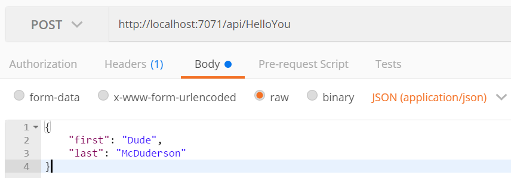
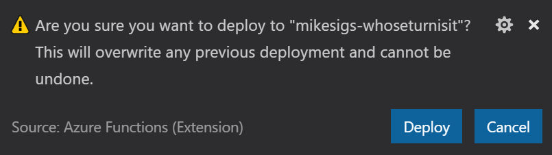

In this post I will walk you through the steps required to create a simple Azure Function using F# and VS Code.
I'll cover everything from what you need to install, all the way to creating and deploying the function to your Azure account.

## Setup your environment

There seem to be a plethora of ways to write Azure Functions. You can write them directly in the Azure Portal, you can use Visual Studio, or you can use Visual Studio Code and the CLI. Personally, I love the lightweight feel of Visual Studio Code. It is fast and extremely powerful. I am also a strong believer that all developers should embrace the command line. If you haven't yet already... well now's the perfect time to start!

### 1) Visual Studio Code

To get started, please make sure you've got Visual Studio Code [Visual Studio Code](https://code.visualstudio.com/) installed.

### 2) Install F\#

If you have Visual Studio installed and already included support for F#, then you can skip this step. If not, head over to [fsharp.org](http://fsharp.org/) and download the appropriate version for your system.

### 3) Install the Ionide plugins

If you've done any F# development in VS Code, then you almost certainly have these installed. If not, you'll soon come to learn that **Ionide is awesome!**

For this post, you'll only need the Ionide-fsharp plugin. But it won't hurt to install all three of them now anyways. Use the Visual Studio Code Extensions Marketplace to install them. Just click the Extensions button in the sidebar and search for _"Ionide"_.

#### Ionide-fsharp

For F# intellisense, document formatting, syntax and error highlighting, and more. It also provides project scaffolding using a tool called [Forge](http://fsharp-editing.github.io/For
ge/).

#### Ionide-Paket (optional)

Ionide [Paket](http://fsprojects.github.io/Paket/) integration, for better package management

#### Ionide-FAKE (optional)

Ionide [FAKE](http://fsharp.github.io/FAKE/) integration. FAKE is an amazing build tool for .NET projects.

### 4) Install the Azure Functions Core Tools

This awesome command line tool let's you run your functions locally. It is the exact same runtime used in Azure to host your functions. Pretty cool!

You'll need node.js installed first. Then head over to the [Azure Functions Core Tools](https://github.com/Azure/azure-functions-core-tools) GitHub page to install the tools.

For this post, we're going use v1.0. The beta 2.0 version doesn't support F# script yet, so you have to create a pre-compiled app instead. I will definitely be tackling this topic in a future blog post. I also don't feel like the v2.0 tools provide the same quality of development experience as the v1.0 version. That said, there is a pretty significant caveat to this. v1.0 only runs on Windows. Sorry about that Mac/Linux users :disappointed:

{}

If you don't already have Node installed, or you have an old version and want/need to upgrade.
You should **absolutely** checkout [nvm-windows](https://github.com/coreybutler/nvm-windows).
It enables you to manage multiple installations of node.js on your machine at the same time.

{}

If and/or when you get node.js installed, you can run the following command to install v1.0 of the Azure Functions Core Tools.

```shell
npm i -g azure-functions-core-tools
```

### 5) Install the Azure Functions Extension

There's one more Visual Studio Code extension that we are going to need for this post: the **Azure Functions** extension. Search for and install it in the Extensions sidebar.

This extension leverages the Azure Functions Core Tools to power a lot of its functionality, but it also allows us to create Azure Functions projects specifically designed to work well in VS Code. Unfortunately, we cannot create an F# project with it yet, but it will recognize our F# project the first time we open it in VS Code and give us some goodness then. You'll see what I mean in the next section.

---

## Let There Be Code

Alright, you've got all the tools you need to do some kickass F# development, and a way to test your functions locally. Let's start coding!

### Create the Function App

As I mentioned earlier, the **Azure Functions** extension doesn't support creating F# Function Apps in Visual Studio Code. So we'll just do it from the CLI using the Azure Functions Core Tools.

Open up your favorite console, and create a new directory for your project. I'm gonna call mine something really ~~lame~~ _fun_ like `HelloYou`, then `cd` into it and run `func init`. Optionally, you could have just run `func init HelloYou` from the parent directory and it would have created the directory for you as well.

This will create the following two files: `host.json` and `local.settings.json`, which we won't need to worry much about for now. It also initializes the directory as a git repository and includes a `.gitignore` file catered to Azure Function development.

Now open the project up in VS Code!

{}
Open the current directory in VS Code with the command `code .`
{}

### Azure Functions Extension Prompt

Now that we've created our Function App project, the Azure Functions extension takes notice as soon as we open VS Code.


Click **Yes** and [all of this will be yours](https://github.com/Microsoft/vscode-azurefunctions/blob/master/docs/project.md)!
Granted, it's not _as_ benefitical for an F# project, but I think it's worth it for the `Tasks.json` alone.

After click **Yes**, the command pallette asks you what language your project is in. And for som reason, now there _is_ an option for `F# Script`! Where was that when we were trying to create the project in the first place?! :confused: Yeah... Select it, and let's move on.

### Create a Function

There's a few ways you can create a new function in your app. You could use the `func new` command on the CLI, or you could use the Azure Functions extension in VS Code. They both run through similar steps, prompting you for the details of your function. But for this post we're going to keep using the VS Code extension.

In VS Code, in the sidebar, look for the Azure Functions panel. Hover your mouse over it and you'll see a few buttons. Click on the `Create Function` button.


VS Code will now prompt you, via the command palette at the top, for some details about your function.

1. **The folder containing your function app:** Hit [Enter] to select the current folder.
2. **Select a function template:** Choose "Generic Webhook"
3. **Provide a function name:** "HelloYou"

This will create a subfolder in your project named `HelloYou` with the following files:

- **function.json:** Binding information about the function
- **run.fsx:** The function code itself
- **sample.dat:** A completely useless sample data file. You can delete it.

### Let's See That Sweet Sweet Code

Okay, if you're like me, all this setup probably drove you crazy. And you're glad to finally get a chance to see some code. So without further ado, let's crack open `run.fsx`.

#### Holy Squigglies!

The first thing you'll notice is VS Code throwing a lot of squigglies under everything. **So many undefined types!** Well, not really. You see, at runtime, the Azure Functions hosting environment automatically loads [a bunch of namespaces and assemblies](https://docs.microsoft.com/en-us/azure/azure-functions/functions-reference-fsharp#referencing-external-assemblies) for you. Unfortunately, VS Code doesn't know anything about this. So to make VS Code happy you can add the following code to the beginning of `run.fsx`.

```fsharp
#if !COMPILED

#I @"C:/Program Files/nodejs/node_modules/azure-functions-core-tools/bin/"

#r "Microsoft.Azure.Webjobs.Host.dll"
open Microsoft.Azure.WebJobs.Host

#r "System.Net.Http.Formatting.dll"
#r "System.Web.Http.dll"
#r "System.Net.Http.dll"
#r "Newtonsoft.Json.dll"

#else

#r "System.Net.Http"
#r "Newtonsoft.Json"

#endif
```

All credit goes to [Mikhail Shilkov](https://github.com/mikhailshilkov/) for [the above snippet of code](https://github.com/mikhailshilkov/azure-functions-fsharp-examples#4-function-created-with-cli). While Microsoft aludes to the need (and reason) for this ["editor prelude"](https://docs.microsoft.com/en-us/azure/azure-functions/functions-reference-fsharp#editor-prelude), their suggested fix doesn't actually seem to resolve the problem. Mikhail's, on the other hand, does!

{}
This messy prelude is only required when writing Azure Functions with F# Script (.fsx files). It is possible to use precompiled F# instead (.fs files) and this kludge goes away. However, all things have a cost. To work with precompiled F# means you'll likely want to use FAKE and Paket too. I would recommend this only when your function gets to a certain level of complexity that necessitates it.
{}

With that out of the way, let's look at this code. What does it all do? Unsurprisingly, it's basically just Hello World.

First we open up the namespaces we'll be needing:

```fsharp
open System.Net
open System.Net.Http
open Newtonsoft.Json
```

Then we create a couple record types for our model:

```fsharp
type Name = {
    First: string
    Last: string
}

type Greeting = {
    Greeting: string
}
```

Then there's the actual `Run` function:


```fsharp
let Run(req: HttpRequestMessage, log: TraceWriter) =
    async {
        log.Info("Webhook was triggered!")
        let! jsonContent = req.Content.ReadAsStringAsync() |> Async.AwaitTask

        try
            let name = JsonConvert.DeserializeObject<Name>(jsonContent)
            return req.CreateResponse(HttpStatusCode.OK,
                { Greeting = sprintf "Hello %s %s!" name.First name.Last })
        with _ ->
            return req.CreateResponse(HttpStatusCode.BadRequest)
    } |> Async.StartAsTask
```

It takes two parameters:

1. The incoming `HttpRequestMessage`. This is what's known as a binding, and it is configured in the `function.json` file. We'll look at that soon.
2. A logger that we can use to uh... log stuff. This is automatically injected for us by the runtime. No binding configuration required.

The function body itself is wrapped in an [asynchronous workflow](https://docs.microsoft.com/en-us/dotnet/fsharp/language-reference/asynchronous-workflows). This is similar to a C# `async Task Method()`, but it's using an F# feature called a [computation expression](https://docs.microsoft.com/en-us/dotnet/fsharp/language-reference/computation-expressions) which is essentiall a monad. But let's not even go there. Let's just leave it at: we can make async calls inside the `async { }` thing.

Within this async workflow it does the following:

- Uses our injected logger to write some super helpful information to the console
- Asynchronously reads the body of our http request into `jsonContent`
- Uses Json.Net to deserialize the string value of `jsonContent` into the `name` binding (which is of type `Name`, from the above model types)
- If all goes well it returns a `Task<HttpResponseMessage>` with status 200, and some JSON expressing our sincerest greetings to the calling client
- If the JSON deserialization goes horrible awry, then it returns a 400 BadRequest with absolutely no detail whatsover. Because hackers.
- Finally, at the very end it's all piped into the `Async.StartAsTask` function to begin the async workflow

I must say, it's not the most idiomatic F# code in the world, but it gets the job done.

### Function Bindings

The input parameters and return values of this function are refered to as [bindings](https://docs.microsoft.com/en-us/azure/azure-functions/functions-triggers-bindings). Every function can include multiple input bindings, and one output binding. I won't go into any more detail here though. But definitely read up on the concept at the above link.

In our case, we are using v1.0 of the runtime, so we don't have to bother registering our binding extensions. We can just use the ones we want because they're automatically made available to us by the runtime.

Bindings are defined in the `functions.json` file, which in our case looks like this:

```json
{
  "disabled": false,
  "bindings": [
    {
      "type": "httpTrigger",
      "direction": "in",
      "webHookType": "genericJson",
      "name": "req"
    },
    {
      "type": "http",
      "direction": "out",
      "name": "res"
    }
  ]
}
```

Here we can see that we have two bindings. Our input binding of type `httpTrigger` named `req`, and the output binding, which is simply our returned `HttpResponseMessage` type.

You will notice that the logger isn't mentioned here. And it doesn't need to be. It is automatically made available to us, and entirely optional to use. Thought it is extremely helpful for logging, so you should definitely use it!

---

## Running the Function

So you've got your function created, and you want to test it out! First thing you gotta do is get it running. Once again, you can do this on the CLI with the `func host start` command, or you can leverage the VS Code Azure Functions extension. Remember when you first opened the project and you were prompted to _Initialize for optimal use with VS Code_? Part of that process created a `Tasks.json` file in the `.vscode` folder in your workspace. Let's look at it now.

```json
{
  "version": "2.0.0",
  "tasks": [
    {
      "label": "Run Functions Host",
      "identifier": "runFunctionsHost",
      "type": "shell",
      "command": "func host start",
      "isBackground": true,
      "presentation": {
        "reveal": "always"
      },
      "problemMatcher": [
        {
          "owner": "azureFunctions",
          "pattern": [
            {
              "regexp": "\\b\\B",
              "file": 1,
              "location": 2,
              "message": 3
            }
          ],
          "background": {
            "activeOnStart": true,
            "beginsPattern": "^.*Stopping host.*",
            "endsPattern": "^.*Job host started.*"
          }
        }
      ]
    }
  ]
}
```

The single task in the file, as the `label` suggests, will let you run your function in the Azure Functions host. To invoke this task, open the Command Pallette with `Ctrl+Shift+P` and type "task" then select "Tasks: Run Task". You should see the integrated terminal open in VS Code, displaying a sweet ASCII lightning bolt. Voila! Your function is running. To stop the host just press `Ctrl+C` in the terminal.

### Create a Custom Keybinding

Pro-Tip! You are going to use this task a lot. Do yourself a favor and create a custom keybinding.

Press `Ctrl+Shift+P` and type "keyboard" and select "Preferences: Open Keyboard Shortcuts" (or just press `Ctrl+K Ctrl+S`).

At the top of the window that just opened you'll see some instructions for created advanced customizations. That's where we're headed. Click on the `keybindings.json` link.

In the `keybindings.json` file now open in the right-hand pane, add the following new keybinding:

```json
{
    "key": "ctrl+shift+r",
    "command": "workbench.action.tasks.runTask",
    "args": "Run Functions Host"
}
```

Now you can use `Ctrl+Shift+R` to trigger the task and startup the Azure Functions host!

### Calling the Function From Postman

Once you've started the Azure Functions host, the Terminal window should display a list of the available Http Functions in your app. Currently, there should be just the one: <http://localhost:7071/api/HelloYou>.

Copy that address and fire up Postman. If you don't have Postman, you can install it [here](https://www.getPostman.com/). You could also use Curl, if you like, but I prefer Postman.

We are going to use Postman to make a POST call to <http://localhost:7071/api/WhoPickedWhat> with the following JSON content:

```json
{
  "first": "Dude",
  "last": "McDuderson"
}
```

Your Postman window should look like this:



Click Send and you should get the response:

```json
{
  "Greeting@": "Hello Dude McDuderson!"
}
```

### W@T?!
Hooray! You got your response back. But WTF is up with that '@' symbol in the property name?!

Well that annoying little artifact is there because the default JSON serializer doesn't handle F# record types all that well. You see, the compiler is creating some mutable internal backing fields for each property in our record type. These are needed for serialization to work (you can't exactly write to an immutable record type in F#). So when these automatic fields are created, they are given names based on their related record type property, but with an appended '@' character. These are the fields being used by the serializer, and hence the ones that show up in our response. 

So how do we fix this?! Well, I'm glad you asked!

In ASP.NET Web API you can just modify the global JSON Serialization Settings on your `HttpConfiguration` object. No such luck here. Instead, we'll have to create a new `JsonMediaTypeFormatter`, set the `ContractResolver` to a better one provided by Json.Net, and pass it to `req.CreateResponse`. Easy peasy!

After making these changes, our function now looks like this:

```fsharp
let Run(req: HttpRequestMessage, log: TraceWriter) =
    async {
        log.Info("Webhook was triggered!")
        let! jsonContent = req.Content.ReadAsStringAsync() |> Async.AwaitTask

        let jsonFormatter = System.Net.Http.Formatting.JsonMediaTypeFormatter()
        jsonFormatter.SerializerSettings.ContractResolver
            <- Newtonsoft.Json.Serialization.CamelCasePropertyNamesContractResolver()

        try
            let name = JsonConvert.DeserializeObject<Name>(jsonContent)
            return req.CreateResponse(
                HttpStatusCode.OK, 
                { Greeting = sprintf "Hello %s %s!" name.First name.Last },
                jsonFormatter)
        with _ ->
            return req.CreateResponse(HttpStatusCode.BadRequest)
    } |> Async.StartAsTask
```

If you send your Postman request again you should no longer see that annoying '@' sign.

Why is the default template like this? That is a fantastic question!


---

## Deploy to Azure

Now that we have the function working locally, let's publish it to Azure.

### Create Azure Resource Group

```shell
az group create --name mikesigs-whoseturnisit --location canadacentral
```

### Create Azure Storage Account

```shell
az storage account create --name mikesigsfunctionsstorage --location canadacentral --resource-group mikesigs-whoseturnisit --sku Standard_LRS
```

### Create Function App

```shell
az storage account create --name mikesigsfunctionsstorage --location canadacentral --resource-group mikesigs-whoseturnisit --sku Standard_LRS
```

---


Again, we could do this from the CLI with `func azure functionapp publish <FunctionAppName>`, but we're gonna stick to using the VS Code Azure Functions extension for this too.

In the VS Code sidebar, find the Azure Functions panel again. Hover your mouse over it and this time click the `Deploy to Function App` button.


The VS Code command palette will now prompt you for a few bits of info before deploying your function.

1. **Select the folder to zip and deploy:** Hit [Enter] to select the current folder.
2. **Select a Subscription:** Hit [Enter] to select the current subscription. //TODO - Did we login already?
3. **Select a Function App:** mikesigs-whoseturnisit

Next you should see a prompt in the bottom corner confirming that you actually do what to overwrite your existing function. Click "Deploy".



If all goes well you should see a bunch of white text in the VS Code Output window with no errors whatsoever. Although, it will tell you that:

> WARNING: Some http trigger urls cannot be displayed in the output window because they require an authentication token. Instead, you may copy them from the Azure Functions explorer.

So we need to get a URL to our deployed function. And we need a token to call it. Let's get to that in the next section.

{}

In the real world, you wouldn't deploy to Azure like this. You would have a proper CI/CD pipeline to build, test, and _then_ deploy the function!

{}

### Test your deployed function

To test our deployed function we'll need to figure out what the URL is. Additionally, we'll need a token to authenticate the request. Now you could login to the [Azure Portal](https://portal.azure.com) and dig through a bunch of screens to find that. I'm sure there's probably some fancy way to do it from the CLI even. But fortunately we needn't look any further than the VS Code Azure Functions extension, once again. 

Expand the Azure Functions panel and drill down into your function app. Expand the Functions section and right-click on your new function, and select "Copy Function Url". This will put the URL and the token you need on to the clipboard.

Now head on over to Postman again, and let's fire a request at this bad boy.

Simply replace the localhost URL with the one on your clipboard and click Send. It might take a second or two, but you should soon get the same response that you received locally.

## What's next?

So now you have a function that can say "Hi". That's great. But you can do so much more! You can create new functions, with all sorts of triggers. You can store data in Cosmos! There's plenty of options for Azure Functions. And we're just scratching the surface. 